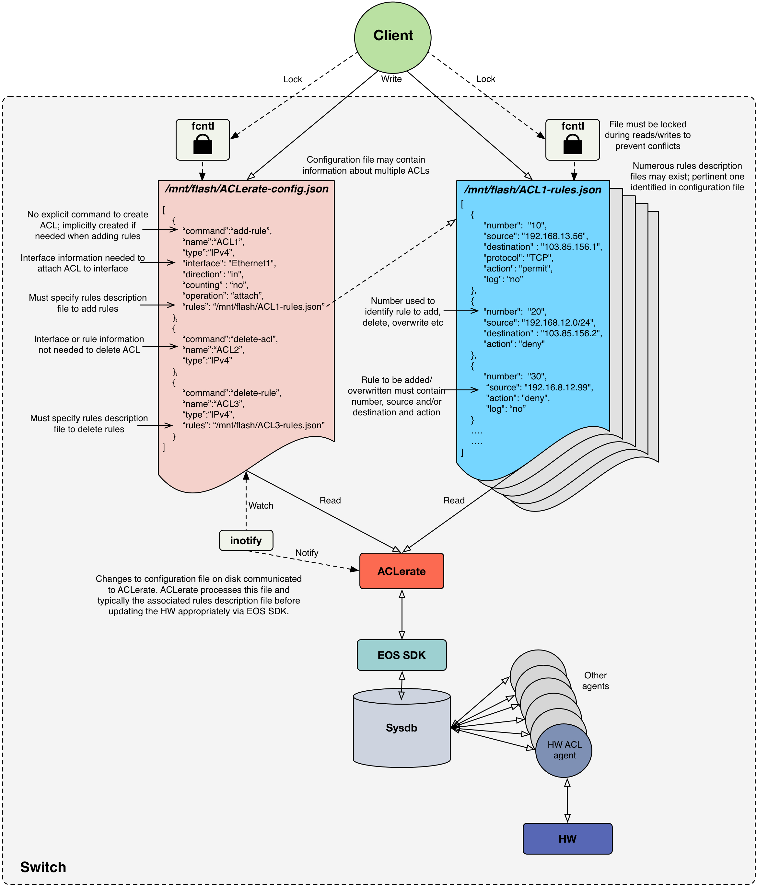

# ACLerate
EOS SDK agent to program ACLs with thousands of rules quickly and efficiently

## Objective
Applying an ACL that contains thousands of rules to a switch via the CLI or eAPI may be impractical due to the excessive time taken to process the ACL.  ACLerate aims to provide a solution to this problem by leveraging EOS SDK to allow large ACLs to be programmed more quickly and efficiently.

## Overview
ACLerate will run as an EOS agent and use EOS SDK to apply ACLs specified by the client to the switch.  ACLerate essentially seeks to leverage EOS SDK to update SysDB directly, thus avoiding the lengthy process of parsing the ACL configuration and loading it into SysDB.

As shown in Figure 1, the main way the client communicates with ACLerate is via JSON files.  JSON is chosen as it is a popular, flexible and lightweight means of describing the information that is required for ACLerate to handle the client’s request.  The two types of JSON files needed are: 
* configuration file 
  * contains an array with each element corresponding to an ACL and containing information that
    * describes the ACL
    * identifies the command the client wishes to execute (e.g. to add rules, remove rules or delete the ACL)
    * specifies the interface should the client wish to attach or detach the ACL from an interface
    * points to to the rule description file, i.e. the JSON file containing information about the rules to be added, overwritten or removed from the ACL.
  * must be called ```/mnt/flash/ACLerate-config.json``` 
  * must be locked using the ```fcntl flock()``` locking system calls when being modified.
  * updates to this file will be automatically detected by ACLerate and will trigger it to be processed.

* rules description file
  * contains an array with potentially thousand of elements, each corresponding to a rule and containing information that:
    * describes the rule in question (e.g. the action, sequence number, traffic characteristics to match etc)
  * must be referenced by the corresponding ACLerate configuration file, allowing the rules to be associated with an ACL.
  * may be referenced by multiple configuration files, i.e. it is legitimate for the same rules description file to be associated with different ACLs (e.g. to conveniently facilitate applying the same rules to different interfaces or directions).
  * must be locked using the ```fcntl flock()``` locking system calls when being modified.

ACLerate uses inotify to track any changes to the ACLerate configuration file.  Upon being notified that this file has been modified, ACLerate will parse the JSON therein and attempt to execute the command specified, accessing the rules description file as/when necessary using the data in the referenced file.


Figure 1: Overview of ACLerate

## JSON Objects
### Configuration File
The ACLerate configuration file contains a JSON array each element of which contains information about an ACL. This information includes the ACL nam, typee and the command the client wishes to execute.  These commands, listed below, define what JSON attributes are mandatory and which are optional:
* add-rule
  * add rules in the rules description file
  * if ACL does not exist, it is created and all the rules added (i.e. there is no explicit command to create an ACL)
  * if ACL exists, any existing rules (based on the rule number)  will be overwritten and any new rules will be added
* delete-rule
  * delete rules in the rules description file
  * if ACL does not exist, error
  * if ACL exists but does not contain rule, no op
* delete-acl
  * delete ACL and all constituent rules
  * if ACL does not exist, no op

The JSON objects in the ACLerate configuration file are described in the following table:

Attribute  | Mandatory? | Description | Comment
------------- | ------------- | ------------- | -------------
name  | Yes | ACL name | Must be unique.  Must not contain invalid characters, e.g. "/", ".", " " etc
command | Yes | Command to execute on ACL | Must be “add-rule”, “delete-rule” or “delete-acl"
type  | Yes | ACL type | Must be “IPv4”, “IPv6” or “MAC”.  Note only IPv4 ACLs currently supported
interface | No | Interface to which ACL should be attached or detached | Should be included only if client wishes to attach or detach ACL to/from interface
operation | No | Should ACL be attached or detached to/from interface? | Must be “attach” or “detach”.  Must be present if interface is present
direction | No | Direction to which ACL should be applied | Must be “in” or “out”. Must be present if interface is present
rules | No | Identifies file containing rules associated with ACL | Rules description file may be omitted only when ACL is being deleted
counting | No | Count the number of packets matching each rule in the ACL? | Must be “yes” or “no”.  Default is "no"

### Rules Description File
The rules description files contains an array of information about the rules associated with the ACL.  It is expected that this array could contain multiple thousand elements.  The information for each rule is described in the following table:

Attribute  | Mandatory? | Description | Comment
------------- | ------------- | ------------- | -------------
number  | Yes | Rule sequence number | Used to identify rule when deleting, overwriting or adding rule
source | No | Source address | Either source or destination must be present if adding or overwriting rule.  Neither needed for deleting the rule
destination | No | Destination address | Either source or destination must be present if adding or overwriting rule.  Neither needed for deleting the rule.
action | No | Action to be taken for matching packets | Must be “permit” or “deny”.  Must be present for adding or overwriting rules.  May be omitted for deletes.
protocol | No | IP or MAC protocol of interest | Only certain protocols currently supported
log | No | Should matching packets be logged? | Must be “yes” or “no”.  Default is "no"

## Installation
ACLerate may be installed using the SWIX provided or manually.

The SWIX is installed using the usual steps for EOS extensions:
```
Arista#copy <source>/ACLerate-<version>.swix extension:                                                                                                                                                                        Copy completed successfully.
Arista#extension <version>.swix 
```
To verify that the extension is installed successfully: ```Arista#show extensions```
As part of the installation process, the ACLerate daemon should have been started automatically.  Therefore, the following configuration should now be present when the running configuration is viewed:
```
daemon ACLerate
exec /mnt/flash/ACLerate
no shut
```
Lastly, if it is desired that ACLerate should be loaded automatically at boot time, the boot extensions must be modified accordingly:
```
Arista# show installed-extensions
ACLerate-<version>.swix

Arista# show boot-extensions

Arista# copy installed-extensions boot-extensions
Copy completed successfully.

Arista# show boot-extensions
ACLerate-<version>.swix
```

Alternatively, ACLerate may be installed manually.  The first step in doing so is to copy the ACLerate script to the switch:
```
scp ACLerate.py <user name>@<switch IP address>:/mnt/flash
```
Next, ACLerate must be configured to interact with Sysdb by dropping into bash on the switch and executing	
```
sudo cp /usr/lib/SysdbMountProfiles/EosSdkAll /usr/lib/SysdbMountProfiles/ACLerate
```
And then editing ```/usr/lib/SysdbMountProfiles/ACLerate```, changing first line to being ```agentName:ACLerate-%sliceId```

Lastly, the ACLerate daemon may be started using the conventional EOS daemon CLI:
```
configure 
daemon ACLerate
exec /mnt/flash/ACLerate.py
no shut
```

## Usage Instructions
1. Create the rules description file (with the JSON describing the rules to be initially added to the ACL) and copy to the switch.
2. Create the configuration file which describes the ACL to be created and copy to  ```/mnt/flash/ACLerate-config.json```.  This file should reference the rules description file in (1).  The addition of this file will be automatically detected with ACLerate.  Note that, alternatively, this file may be created before ACLerate is started; when ACLerate is initialising it checks for the existence of this file and attempts to process it.  Therefore, the relative ordering of adding this file and starting ACLerate is inconsequential.
3. Verify that ACLerate has processed the files in (1) and (2) correctly and created the desired ACL on the switch by using commands such as ```show ip access-lists``` or platform-specific show commands.  However, it should be noted that, since this ACL was not created using the CLI, it will not appear in the running configuration. 
4. The configuration file and the rules description file may be subsequently updated to add new rules, delete rules, overwrite rules, delete the ACL or even add additional ACLs etc.  ACLerate should automatically detect any changes to the configuration file and respond accordingly.  In order to prevent the read/write conflicts to these files (e.g. if the client is “badly behaved” and modifies the files quicker than ACLerate or the HW can process them), ACLerate locks these files while processing them.  Hence, the client should also attempt to individually lock the configuration file or rules description file before modifying them.  The ```fcntl flock()``` locking system calls should be used by the client to lock the files, as highlighted in the following Python excerpt: 
```
import fcntl
ACLerate_config_file = '/mnt/flash/ACLerate-config.json'
acl_config_file = open(ACLerate_config_file)

try:
    fcntl.flock(acl_config_file, fcntl.LOCK_EX | fcntl.LOCK_NB)
except IOError:	
    print "Could not lock file"
    #Perhaps wait then reattempt locking?
	
#Have exclusive access to file here so safe to modify
 
#Explicitly unlocking may be unnecessary; closing file implicitly unlocks it
fcntl.flock(acl_config_file, fcntl.LOCK_UN)
```


## Debugging
ACLerate logs information about salient events to ```/var/log/messages```, as illustrated by the following excerpt: 
```
Apr 12 10:30:38 DCS-7050T Launcher: %LAUNCHER-6-PROCESS_START: Configuring process 'ACLerate' to start in role 'ActiveSupervisor'
Apr 12 10:30:39 DCS-7050T ACLerate.py: Initialization starting
Apr 12 10:30:39 DCS-7050T ACLerate.py: %AGENT-6-INITIALIZED: Agent 'ACLerate-ACLerate' initialized; pid=6016
Apr 12 10:30:39 DCS-7050T ACLerate.py: Initialization complete. Process initial configuration file(s)
Apr 12 10:30:39 DCS-7050T ACLerate.py: Attempting to process configuration file(s)
Apr 12 10:30:39 DCS-7050T ACLerate.py: Attempting to open, lock and parse /mnt/flash/ACLerate-config.json
Apr 12 10:30:39 DCS-7050T ACLerate.py: /mnt/flash/ACLerate-config.json opened & locked successfully. Now parse
Apr 12 10:30:39 DCS-7050T ACLerate.py: Attempting to open, lock and parse /mnt/flash/ACLerate-rules.json
Apr 12 10:30:39 DCS-7050T ACLerate.py: /mnt/flash/ACLerate-rules.json opened & locked successfully. Now parse
Apr 12 10:30:39 DCS-7050T ACLerate.py: Time to parse config files for ACL ACLerate-ACL-test13 is 0.00654101371765s
Apr 12 10:30:39 DCS-7050T ACLerate.py: Processing complete (30 rules).  Now commit ACL ACLerate-ACL-test13 to HW
Apr 12 10:30:39 DCS-7050T ACLerate.py: Attaching ACL ACLerate-ACL-test13 to interface Ethernet13 inbound
Apr 12 10:30:39 DCS-7050T ACLerate.py: ACL programming success callback from HW
Apr 12 10:30:39 DCS-7050T ACLerate.py: HW programming duration is 0.0240302085876s
Apr 12 10:30:39 DCS-7050T ACLerate.py: Overall duration is 0.0305712223053s
```

Should an error occur, additional and more detailed information about the error encountered will be logged to ```/var/log/agents/ACLerate-<PID>```.  For example, if an invalid command is issued, the information logged to this file is along the lines of:
```
===== Output from /mnt/flash/ACLerate.py [] (PID=14618) started Apr 11 15:14:59.955878 ===
'add-acl' is not a valid command
Invalid ACL input data
```
