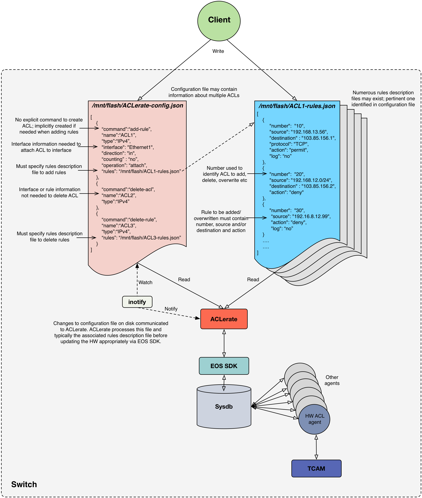

# ACLerate
EOS SDK agent to program ACLs with thousands of rules quickly and efficiently

## Objective
Applying an ACL that contains thousands of rules to a switch via the CLI or eAPI may be impractical due to the excessive time taken to process the ACL.  ACLerate aims to provide a solution to this problem by leveraging EOS SDK to allow large ACLs to be programmed more quickly and efficiently.

## Overview
ACLerate is started and stopped using the conventional CLI for executing EOS SDK daemons. As shown in Figure 1, the main way the client communicates with ACLerate is via JSON files.  JSON is chosen as it is a popular, flexible and lightweight means of describing the information that is required for ACLerate to handle the client’s request.  The two types of JSON files needed are: 
* configuration file 
  * contains an array with each element corresponding to an ACL and containing information that
    * describes the ACL
    * identifies the command the client wishes to execute (e.g. to add rules, remove rules or delete the ACL)
    * specifies the interface should the client wish to attach or detach the ACL from an interface
    * points to to the rule description file, i.e. the JSON file containing information about the rules to be added, overwritten or removed from the ACL.
  * must be called ```/mnt/flash/ACLerate-config.json``` 
  * updates to this file will be automatically detected by ACLerate and will trigger it to be processed.

* rules description file
  * contains an array with potentially thousand of elements, each corresponding to a rule and containing information that:
    * describes the rule in question (e.g. the action, sequence number, traffic characteristics to match etc)
  * must be referenced by the corresponding ACLerate configuration file, allowing the rules to be associated with an ACL.
  * may be referenced by multiple configuration files, i.e. it is legitimate for the same rules description file to be associated with different ACLs (e.g. to conveniently facilitate applying the same rules to different interfaces or directions).

ACLerate uses inotify to track any changes to the ACLerate configuration file.  Upon being notified that this file has been modified, ACLerate will parse the JSON therein and attempt to execute the command specified, accessing the rules description file as/when necessary using the data in the referenced file.


Figure 1: Overview of ACLerate

## JSON Objects
### Configuration File
The ACLerate configuration file contains a JSON array each element of which contains information about an ACL. This information includes the ACL nam, typee and the command the client wishes to execute.  These commands, listed below, define what JSON attributes are mandatory and which are optional:
* add-rule
  * add rules in the rules description file
  * if ACL does not exist, it is created and all the rules added (i.e. there is no explicit command to create an ACL)
  * if ACL exists, any existing rules (based on the rule number)  will be overwritten and any new rules will be added
* delete-rule
  * delete rules in the rules description file
  * if ACL does not exist, error
  * if ACL exists but does not contain rule, no op
* delete-acl
  * delete ACL and all constituent rules
  * if ACL does not exist, no op

The JSON objects in the ACLerate configuration file are described in the following table:

Attribute  | Mandatory? | Description | Comment
------------- | ------------- | ------------- | -------------
name  | Yes | ACL name | Must be unique.  Must not contain invalid characters, e.g. "/", ".", " " etc
command | Yes | Command to execute on ACL | Must be “add-rule”, “delete-rule” or “delete-acl"
type  | Yes | ACL type | Must be “IPv4”, “IPv6” or “MAC”.  Note only IPv4 ACLs currently supported
interface | No | Interface to which ACL should be attached or detached | Should be included only if client wishes to attach or detach ACL to/from interface
operation | No | Should ACL be attached or detached to/from interface? | Must be “attach” or “detach”.  Must be present if interface is present
direction | No | Direction to which ACL should be applied | Must be “in” or “out”. Must be present if interface is present
rules | No | Identifies file containing rules associated with ACL | Rules description file may be omitted only when ACL is being deleted
counting | No | Count the number of packets matching each rule in the ACL? | Must be “yes” or “no”.  Default is "no"

### Rules Description File
The rule description files contains an array of information about the rules associated with the ACL.  It is expected that this array could contain multiple thousand elements.  The information for each rule is described in the following table:

Attribute  | Mandatory? | Description | Comment
------------- | ------------- | ------------- | -------------
number  | Yes | Rule sequence number | Used to identify rule when deleting, overwriting or adding rule
source | No | Source address | Either source or destination must be present if adding or overwriting rule.  Neither needed for deleting the rule
destination | No | Destination address | Either source or destination must be present if adding or overwriting rule.  Neither needed for deleting the rule.
action | No | Action to be taken for matching packets | Must be “permit” or “deny”.  Must be present for adding or overwriting rules.  May be omitted for deletes.
protocol | No | IP or MAC protocol of interest | Only certain protocols currently supported
log | No | Should matching packets be logged? | Must be “yes” or “no”.  Default is "no"
